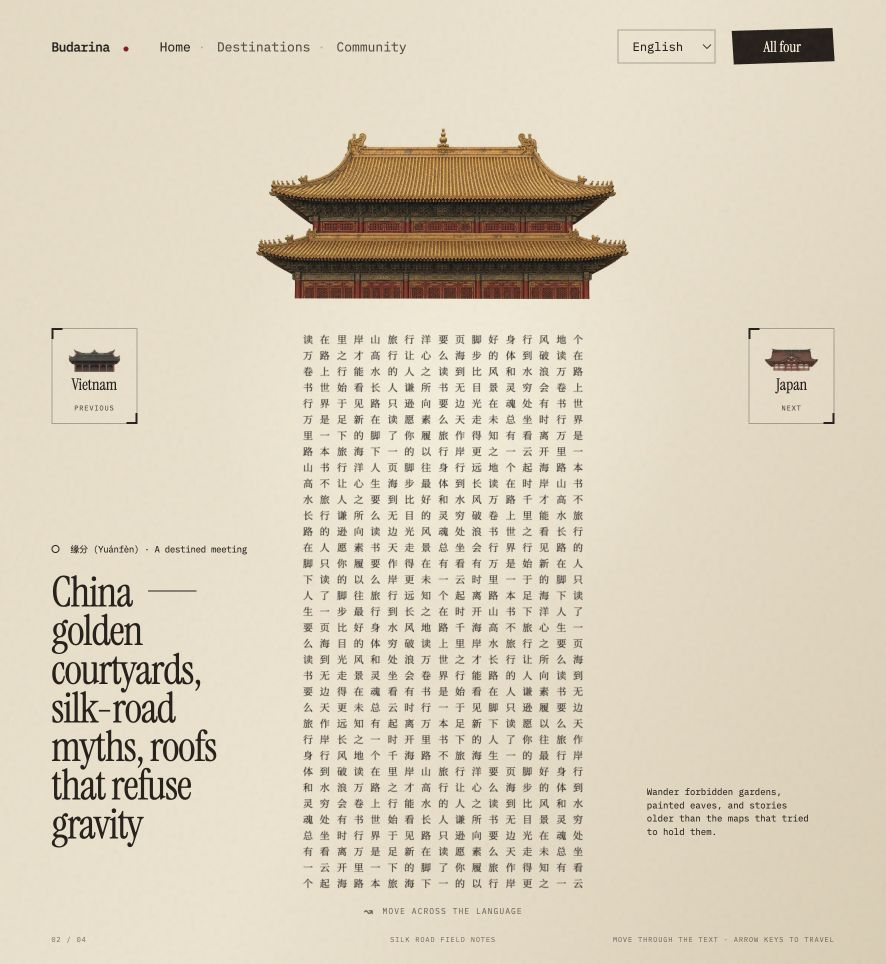

# Budarina — Tactile Atlas

[简体中文](README.md) | **English**

An interactive architectural atlas with four language curtains and a shared travel notebook.

[Open the live site](https://budarina-tactile-atlas.qingyan.chatgpt.site/) · Published by **RJMSWD**

Includes English, 简体中文, and 日本語 interfaces, interactive cloth typography, four destination pages, and a public shared notebook.

## Live experience

**[Open Budarina](https://budarina-tactile-atlas.qingyan.chatgpt.site/)** — no download or installation required.

- **Home:** move the pointer or touch the text curtain, switch countries, or open the four-country overview.
- **Destinations:** explore Vietnam, China, Japan, and Kazakhstan, then enter each country's text curtain.
- **Community:** read and publish public travel notes, filter by country, and remove your own notes from the browser used to publish them.
- **Languages:** switch between English, Chinese, and Japanese using the header selector. Your choice is remembered.

The repository contains the source code; the live link opens the working application, including the shared notebook.

## Screenshots

### Home — interactive text curtain



### Four-country overview


## Run locally

Use Node.js 22.13 or newer.

```sh
npm ci
npm run dev
```

The development server prints its local URL. The site uses Next.js components through Vinext and runs on Cloudflare Workers. Existing dependencies and the lockfile are retained.

## Project map

- `app/page.tsx` and `app/components/`: accessible page structure for Home, Destinations, and Community.
- `app/globals.css`: the original atlas and gallery appearance.
- `app/content.css`: navigation, reading pages, forms, and responsive refinements.
- `public/app.js`: hash navigation and module initialization.
- `public/modules/countries.js`: shared country text and roof asset paths.
- `public/modules/atlas.js`: scene selection, layout measurements, and transitions.
- `public/modules/cloth-engine.js`: fixed-step physics, glyph caching, and independent sleep/wake handling.
- `public/modules/community.js`: notebook loading, filtering, publication, and removal UI.
- `app/api/community/route.ts`: server-side validation, pagination, persistence, and ownership checks.
- `db/schema.ts` and `drizzle/`: database schema and versioned migrations.

## Animation behavior

The simulation uses a 120 Hz fixed step with a maximum of four steps per display frame. Each curtain sleeps only after 24 consecutive quiet steps. Its final pose becomes the cached image; there is no timeout that forces nodes back to their original coordinates. Hidden pages suspend the engine. Navigation cancels obsolete transitions so an earlier animation cannot overwrite a new country selection.

## Interface languages

The header switches between English, Simplified Chinese, and Japanese without reloading. The browser remembers the choice. UI messages and country descriptions live in `public/modules/locales.js`; `i18n.js` updates labels, accessible text, dates, and page titles. Country glyphs and visitor-written notes retain their original language. Switching language preserves the current page, selected country, filters, and form values.

## Shared notebook

Notes are stored in the platform's D1 database (`DB`), not in browser storage. Everyone may read public notes. An anonymous browser generates a random management token; the server stores only its SHA-256 hash. Public API responses never expose this hash or token. Clearing browser storage removes that browser's ability to delete its notes. Removal is soft deletion. This is an account-free guestbook, not an identity-verified social network.

Posts have a 500-character maximum, server-side country/name validation, a 30-second per-owner cooldown, and an idempotent submission ID. Visitor text is rendered with `textContent`, not HTML. The per-owner cooldown is a basic repeated-submit control, not comprehensive bot moderation.

For a fresh local database, build the Worker and apply the initial migration once:

```sh
npm run build
node node_modules/wrangler/bin/wrangler.js d1 execute DB --local --config dist/server/wrangler.json --persist-to .wrangler/state --file drizzle/0000_slim_snowbird.sql
```

Generate future schema changes with `npm run db:generate`; never edit a migration that has already been deployed. Sites applies packaged migrations to production during publication. Local test notes are not copied to production.

## Checks

```sh
npm test
npm run lint
```

Tests exercise cloth settling and suspension, then run the built Worker with an isolated D1 database to verify page structure, publication, public reads, ownership, cooldown, retries, and removal. Browser checks cover navigation, gallery interaction, the form, and narrow-screen layouts.

## Publishing

`.openai/hosting.json` declares the logical database binding and intentionally omits the live site's project ID. Connect your own Sites project before publishing this checkout. The live demo is deployed separately. Publish only this project's built output; never commit credentials, `.env` files, local database state, or output archives.
